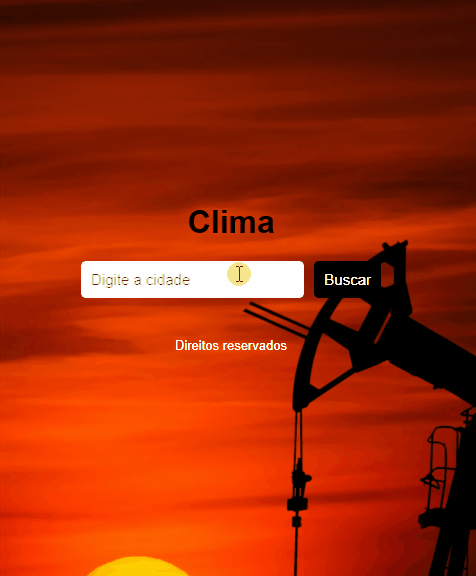

# Clima Local

Consumindo uma API do clima local da sua cidade ou cidades a fora


## Documentação da API

#### API OpenWeather

```http
  Padrão GET
```

| Parâmetro   | Tipo       | Descrição                           |
| :---------- | :--------- | :---------------------------------- |
| `api_key` | `string` | **Obrigatório**. A chave da sua API |

#### Configure a linguage padrão da sua API


## Aprendizados

Projeto desenvolvido a um tempo afim de colocar em prática tudo o que eu vi ao utilizar o JavaScript puro, com ele foi possível fazer uma requisição do tipo GET com a API do OpenWeather utilizando o Fetch API


## Instalação

Para iniciar o projeto clone através da URL no meu Github
projeto simples sem utilização do npm ou yarn
    
## 🚀 Sobre mim
Desenvolvedor FrontEnd Freelancer



